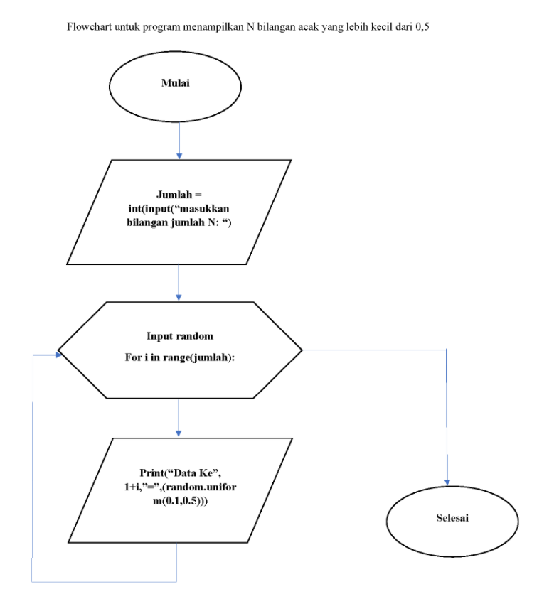
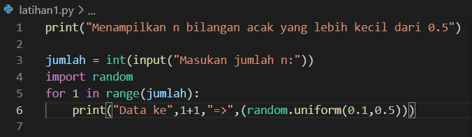
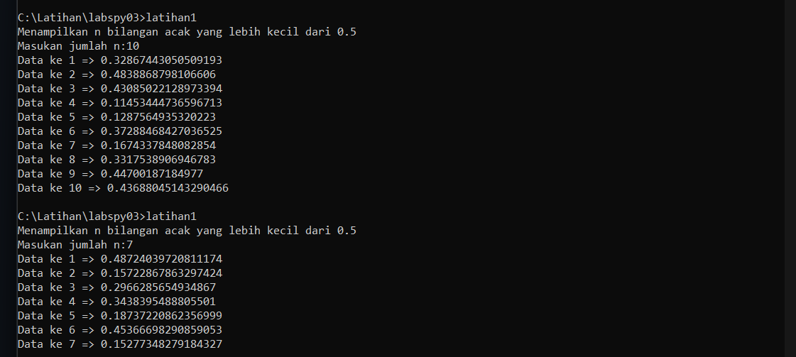
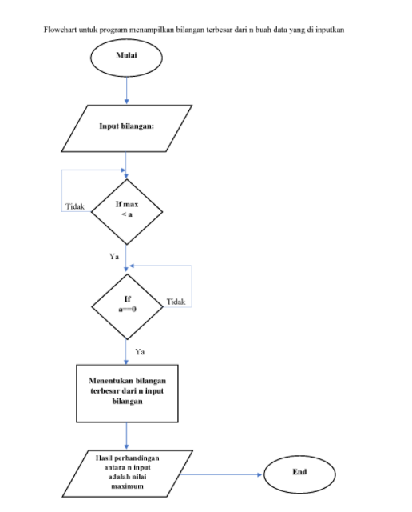
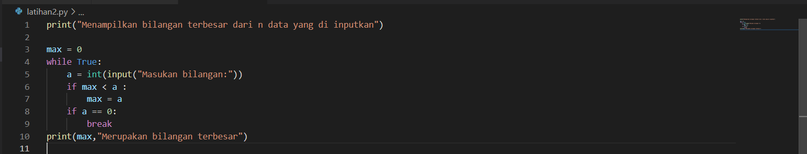
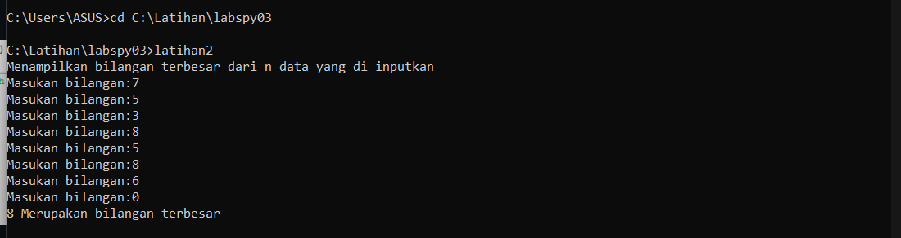

# Labspy03
## Latihan 1
### Membuat program untuk n bilangan acak yang lebih kecil dari 0.5
#### Flowchart
dibawah ini merupakan flowchart untuk latihan 1

#### Program

#### Dan berikut hasil program saya

#### Sekian terima kasih

## Latihan 2
### Membuat program untuk bilangan terbesar dari n data yang di inpukan
#### Flowchart

#### Program

#### Dan berikut hasil programnya

#### Sekian dari saya terima kasih